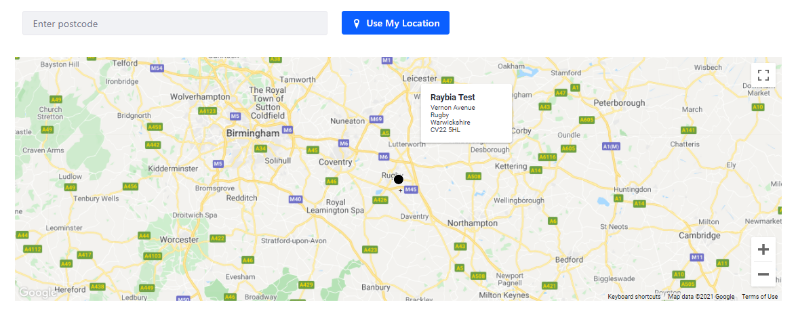
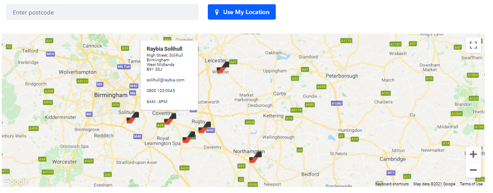
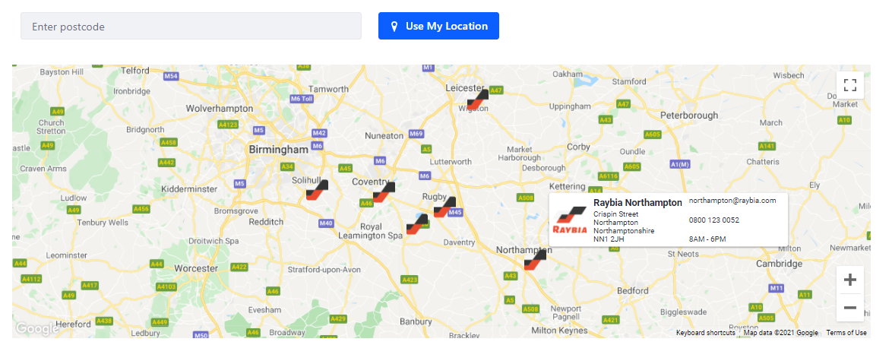
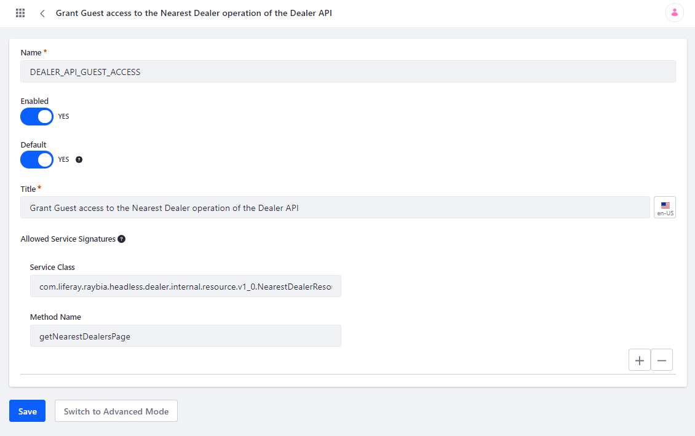

# Dealer Locator

This is an example of how a React based Liferay portlet can be created. It uses Google Maps to display the nearest dealers to the provided location.

## Usage

This module requires the headless API created for the Dealers entity (https://github.com/peterrichards-lr/dealers). All the required modules should
be deployed to the Liferay instance before deploying the Dealer Locator. This has been tested with release 1.0.0 of the API.

### Default (no custom images)

### Custom Marker

### Custom Marker and Logo in Info Window

## Configuration

The configuration of this portlet can be updated via the Instance Settings. There should be a Raybia option under the Other section.

## Service Access Policy

Typically all images and APIs would be accessible to a guest / anonymous user. In the case of images, the easest way to acheive this is creating
a new folder in the Documents and Media admin screen and make it accessible to anyone. All subsequently uploaded files to this folder should
be created with the same permissions as the parent folder.

In order to make the headless API accessible a new Service Access Policy will most likely be needed. The following screenshot shows the configuration.

* **Name**: DEALER_AP_GUEST_ACCESS
* **Title**: Grant Guest Access to the Nearest Dealer operation of the Dealer API
* **Service Class**: com.liferay.raybia.headless.dealer.internal.resource.v1_0.NearestDealerResourceImpl
* **Method Name**: getNearestDealersPage

